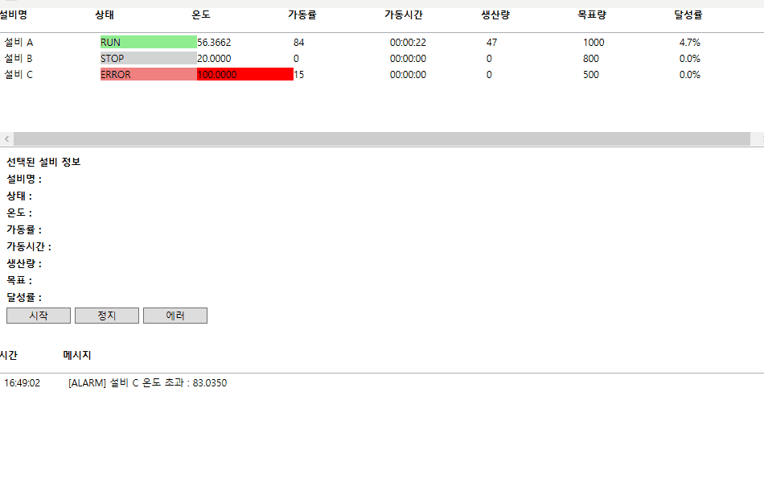
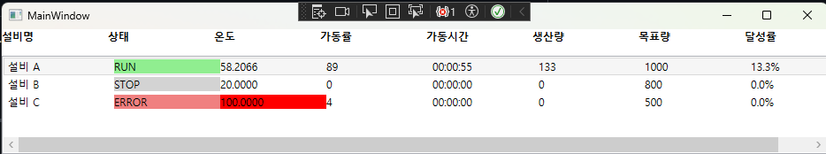
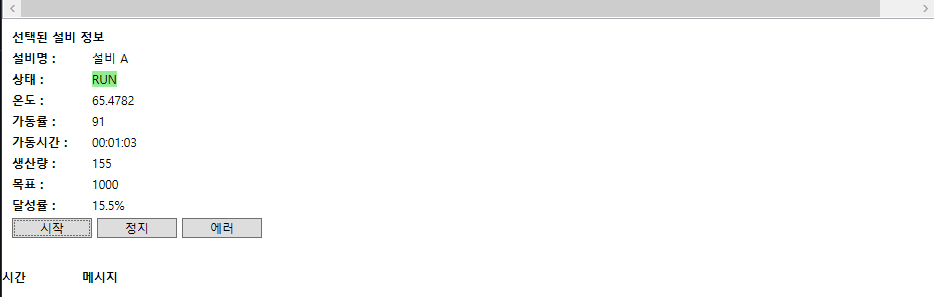
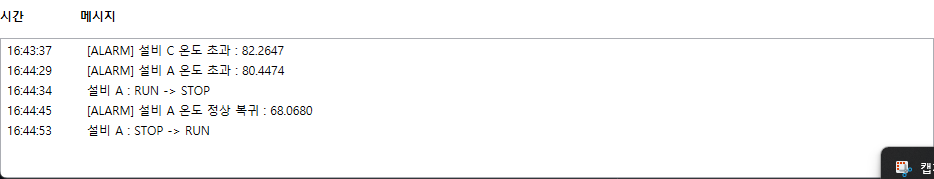

# Factory Monitor

WPF MVVM 패턴을 활용하여 제작한 FA(Factory Automation) 설비 모니터링 시뮬레이션 프로젝트입니다.

설비의 상태(RUN / STOP / ERROR)를 실시간으로 모니터링하고, 온도 및 가동률 데이터를 시뮬레이션하여 생산 설비 관리 시스템의 기본 구조를 구현하였습니다.


---

## 프로젝트 개요

Factory Monitor는 생산 현장의 설비 상태를 모니터링하는 HMI(Human Machine Interface) 형태의 프로그램을 목표로 제작되었습니다.

실제 PLC나 센서와 연동하지는 않지만, 설비 데이터가 지속적으로 변경되는 상황을 가정하여 상태 변화 및 로그 관리를 구현하였습니다.

---

## 기술 스택

### Language
- C#

### Framework
- .NET
- WPF

### Architecture
- MVVM Pattern

### Libraries & Features
- ObservableCollection
- INotifyPropertyChanged
- ICommand
- DispatcherTimer
- StreamWriter (CSV Export)
---

## 주요 기능

### 설비 목록 관리

- 설비 리스트 표시
- 설비 선택 기능
- 실시간 상태 확인

### 설비 상태 제어

- RUN 상태 변경
- STOP 상태 변경
- ERROR 상태 변경

### 실시간 데이터 시뮬레이션

- 온도 자동 변화
- 가동률 자동 변화
- 상태에 따른 데이터 변화

### 상태별 색상 표시

| 상태 | 색상 |
|------|------|
| RUN | Green |
| STOP | Gray |
| ERROR | Red |

### 로그 관리

- 상태 변경 이력 저장
- 최신 로그 자동 출력

예시

```text
[12:30:15] Machine A → RUN
[12:32:40] Machine B → ERROR
[12:35:12] Machine C → STOP
```

### CSV Export

- 설비 정보를 CSV 파일로 저장
- 설비 데이터 백업 가능
- 현재 상태 데이터를 외부 파일로 추출
---

## 과열 시뮬레이션

RUN 상태가 지속될 경우 온도가 점진적으로 상승합니다.

설비가 장시간 동작하면 과열 상태에 진입할 수 있으며, 실제 생산 설비의 열 누적 현상을 단순화하여 구현하였습니다.

## 실행 화면

### 설비 목록



### 설비 상세 정보



### 로그 모니터링



---

## 프로젝트 구조

```text
FactoryMonitor
│
├── Models
│   └── Machine.cs
│
├── ViewModels
│   └── MainViewModel.cs
│
├── Commands
│   └── RelayCommand.cs
│
├── Views
│   └── MainWindow.xaml
│
└── App.xaml
```

---

## MVVM 구조

### Model

설비 데이터 관리

```text
Machine
 ├── Name
 ├── Status
 ├── Temperature
 └── OperationRate
```

### ViewModel

UI와 데이터 연결

```text
MainViewModel
 ├── Machines
 ├── SelectedMachine
 ├── Logs
 ├── StartCommand
 ├── StopCommand
 └── ErrorCommand
```

### View

화면 구성 및 데이터 바인딩

```text
MainWindow.xaml
```

## 구현 내용

- MVVM 패턴 기반 설계
- 설비 상태 실시간 모니터링
- ObservableCollection을 활용한 UI 자동 갱신
- DispatcherTimer 기반 데이터 시뮬레이션
- ICommand를 활용한 상태 제어
- 설비 상태별 색상 표시
- 로그 시스템 구현
- 설비 상세 정보 조회 기능

---

## 향후 개선 계획

- SQLite 연동
- 설비 이력 저장 기능
- 설비 알람 기능
- 실시간 차트 표시
- PLC 통신 연동 (Modbus/TCP)
- 설비 데이터 영구 저장

---

## Skills

- C#
- WPF
- MVVM
- XAML
